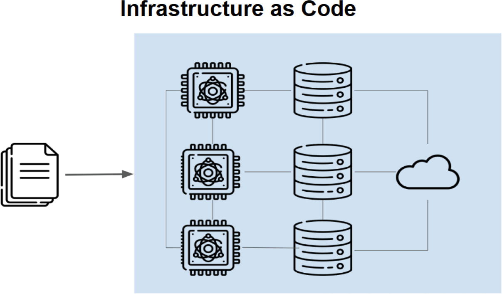

# Lesson One | SECTION 1: Introduction to Infrastructure as Code and Terraform

**Learning Objectives:**
- Understand the problems with traditional infrastructure management
- Learn what Infrastructure as Code (IaC) means and why it matters
- Discover Terraform's core features and benefits
- Grasp the fundamental concepts that make Terraform powerful

---

## Part 1: The Journey from Manual to Automated Infrastructure

### The Traditional Way: A Real-World Story

Let me paint you a picture. Imagine you're a data scientist at a fast-growing e-commerce company. Your company uses Google Cloud Platform, and you've just been assigned to set up infrastructure for a new machine learning project. 

**Your task seems simple:**
- Create a virtual machine
- Set up storage
- Configure networking
- Install required software

### The Two Traditional Approaches

You have two options for creating a single virtual machine:

#### Option 1: The Graphical User Interface (GUI)

Picture this: You log into the Google Cloud Console through your browser. You see a beautiful interface with buttons and forms. To create a VM:

1. Click "Compute Engine"
2. Click "Create Instance"
3. Fill out a form:
   - Name: `instance-example`
   - Region: `europe-west3`
   - Zone: `europe-west3-a`
   - Machine type: Select from dropdown
   - Boot disk: Choose operating system
   - Networking: Configure firewall rules
4. Click "Create"

**Time taken:** 5-10 minutes for one VM  
**What happens:** You click through multiple screens, filling forms, hoping you don't miss anything.


#### Option 2: The Command-Line Interface (CLI)

For the tech-savvy, there's a faster way. One command:

```bash
gcloud compute instances create instance-example \
    --image-family debian-11 \
    --image-project debian-cloud \
    --machine-type e2-medium \
    --subnet default \
    --zone europe-west3-a
```

**Time taken:** 30 seconds (if you know the command)  
**What happens:** You type the command, hit enter, and the VM is created.

### When Things Get Complicated: The Reality Check

Now here's where the story takes a turn. Your project is successful! Your company is growing rapidly. Suddenly:

- You need **400 virtual machines** instead of 1
- They must be spread across **3 regions** (US, Europe, Asia)
- They serve **8 different departments** (Marketing, Sales, Engineering, Data Science, etc.)
- Each department has **4 environments** (Development, Testing, Staging, Production)

**Quick Math:** 400 VMs × 3 regions × 8 departments × 4 environments = A LOT of clicking or typing!

### The Eleven Problems of Traditional Infrastructure Management

Let me walk you through the real challenges organizations face. These aren't theoretical problems—these happen every day in companies worldwide.

#### Problem 1: Time-Consuming Processes

**The Reality:**
- Creating 1 VM via GUI: 5-10 minutes
- Creating 400 VMs via GUI: 2,000-4,000 minutes (33-66 HOURS of pure clicking!)
- That's over 8 full workdays of someone just creating VMs

**The Cost:**
- Engineer's time wasted on repetitive tasks
- Delayed project launches
- Missed business opportunities

**Real Example:** A startup needed to scale from 10 to 100 servers in one week. With manual processes, it took three engineers working overtime for 5 days. With automation, it could have taken 30 minutes.

#### Problem 2: Error-Prone Configurations

**The Reality:**
Even the most careful person makes mistakes when doing repetitive tasks. Common errors include:

- **Typo in machine name:** `prod-server-01` vs `prod-sever-01` (notice the missing 'r')
- **Wrong region selected:** Clicked US-East when you meant US-West
- **Forgot to enable firewall rule:** Server created but not accessible
- **Selected wrong machine size:** Paid for expensive VM when cheap one would work

**The Cascade Effect:**
One small mistake can cause:
- Security vulnerabilities
- Performance issues
- Cost overruns
- System downtime

**Real Example:** An engineer accidentally created 50 high-memory VMs (expensive) instead of standard VMs (cheap). Cost difference: $10,000 per month. The mistake wasn't caught for 2 weeks. Cost to company: $5,000 for a simple typo.

#### Problem 3: Inconsistent Setups

**The Scenario:**
You create servers for three environments:

**Development Server (created Monday morning):**
- Machine type: e2-medium
- Disk size: 20GB
- Python version: 3.9

**Testing Server (created Tuesday afternoon):**
- Machine type: e2-medium
- Disk size: 30GB (you forgot the exact size from Monday)
- Python version: 3.10 (newest version was released)

**Production Server (created Friday, you're tired):**
- Machine type: e2-standard (you clicked wrong option)
- Disk size: 20GB
- Python version: 3.9

**The Problem:**
Your code works in development, breaks in testing, and behaves strangely in production. Why? Because the servers aren't identical. You spend hours debugging, only to realize the environments are different.

**The Hidden Cost:**
- Hours of debugging
- Team frustration
- Delayed releases
- Lost trust in your infrastructure

#### Problem 4: Increased Complexity in Manual Configurations

**The Growth Pattern:**

**Month 1:** 10 servers, easy to manage  
**Month 3:** 50 servers, getting challenging  
**Month 6:** 200 servers, overwhelming  
**Month 12:** 500 servers, impossible to track manually

**The Components Multiply:**
- Virtual machines
- Storage buckets
- Databases (SQL, NoSQL)
- Load balancers
- Firewalls
- VPN connections
- DNS records
- SSL certificates
- Monitoring tools
- Backup systems

**The Relationships Complicate:**
Each component depends on others:
- VM needs networking → Networking needs firewall → Firewall needs rules → Rules need IP ranges
- One change ripples through everything

**Real Example:** A company tried to update their firewall rules manually. They had to update 200 servers. They forgot 15 of them. Those 15 servers became unreachable. It took 3 days to find and fix all of them.

#### Problem 5: Insufficient Documentation

**The Documentation Problem:**

**What Should Be Documented:**
- What was created?
- When was it created?
- Who created it?
- Why was it created?
- What configuration was used?
- What are the dependencies?

**What Actually Gets Documented:**
Often... nothing. Or maybe a quick note: "Created server for John's project - Friday 3pm"

**The GUI Challenge:**
When you click through a GUI:
- No automatic record is created
- You have to manually document everything
- You forget details
- Documentation becomes outdated

**The Consequence:**
Six months later, someone asks: "Why do we have this expensive server in region Asia?" Nobody knows. Nobody wants to delete it in case it's important. You keep paying for it.

**Real Example:** A company discovered they were paying $2,000/month for a database that nobody was using. It had been created 2 years ago for a project that was cancelled. Nobody documented it. Nobody remembered it. Total waste: $48,000.

#### Problem 6: Scaling Challenges

**The Manual Scaling Reality:**

**Scenario:** Your website is featured on national TV. Traffic increases 10x in 10 minutes.

**What Needs to Happen:**
- Monitor traffic (you're watching nervously)
- Decide you need more servers
- Log into cloud console
- Create new servers (5 minutes each)
- Configure load balancer (10 minutes)
- Test everything (5 minutes)

**Total Time:** 30-45 minutes while your website is slow or crashing

**What Users Experience:**
- Slow loading pages
- Failed transactions
- Frustration
- They go to your competitor

**The Cost:**
- Lost sales during downtime
- Damaged reputation
- Angry customers on social media

**With Automation:**
- System detects increased traffic
- Automatically creates new servers
- Automatically configures load balancing
- **Total Time:** 2 minutes
- Users never notice any slowdown

#### Problem 7: Dependency on Key Individuals

**The Scenario:**

**Your Company Has:**
- Sarah: The only person who knows how the production servers are configured
- Tom: The only person who understands the networking setup
- Lisa: The only person who can fix database issues

**The Problem:**

**What Happens When:**
- Sarah goes on vacation? Production changes are frozen for 2 weeks
- Tom gets sick? Network issues can't be resolved
- Lisa leaves the company? Database knowledge walks out the door

**The "Bus Factor":**
How many team members can be hit by a bus before your project fails? If it's one or two, you're in danger.

**The Solution IaC Provides:**
The infrastructure is documented in code. Anyone on the team can read the code and understand how everything works. Knowledge is shared, not locked in people's heads.

#### Problem 8: Limited Rollback Options

**The Disaster Scenario:**

**Friday 4:30 PM:** You make a configuration change to production

**Friday 4:45 PM:** Something breaks. Website is down.

**Friday 5:00 PM:** You need to undo the change, but:
- Which settings did you change exactly?
- What were the old values?
- Are there dependencies you're forgetting?
- What else did you modify while fixing other things?

**Friday 5:30 PM:** You're still guessing and trying different things

**Friday 6:30 PM:** Finally fixed, maybe. You're not 100% sure what you changed.

**The Weekend:** You worry the whole time that something else might break

**With Version Control (IaC):**
- Friday 4:45 PM: Something breaks
- Friday 4:46 PM: Run `git revert` to go back to previous version
- Friday 4:47 PM: Everything is working again
- Friday 5:00 PM: You go home happy

#### Problem 9: Communication Gaps

**The Multi-Team Challenge:**

**Typical Company Structure:**
- **Development Team:** Creates new features, needs infrastructure
- **Operations Team:** Manages infrastructure, needs to keep things stable
- **Security Team:** Needs to enforce security policies
- **Management:** Needs to control costs

**The Communication Breakdown:**

**Scenario 1:** Developers need new servers
- Developers: "We need 10 new servers by Monday"
- Operations: "Submit a ticket, we'll get to it in 2 weeks"
- Developers: Get frustrated, create servers themselves
- Operations: Discovers unauthorized servers, gets angry
- Security: Finds security holes in unauthorized servers
- Management: Gets surprise cloud bill

**Scenario 2:** Configuration changes
- Operations changes firewall rules for security
- Developers' application breaks
- Nobody told developers about the change
- Developers spend hours debugging
- Finally call operations
- "Oh yeah, we changed that yesterday"

**The IaC Solution:**
- Infrastructure is code in a shared repository
- Everyone can see proposed changes
- Changes go through review process
- All teams collaborate on the same infrastructure code
- Changes are transparent and documented

#### Problem 10: Auditability Challenges

**The Compliance Requirement:**

**Regulations Require You to Know:**
- Who made changes to infrastructure?
- When were changes made?
- Why were changes made?
- What exactly was changed?
- Can you prove it?

**The Manual Process Challenge:**

**Questions Auditors Ask:**
- "Who created this server with access to customer data?"
- "When was the firewall rule changed?"
- "Why does this user have admin access?"

**Your Answer (Without IaC):**
- "Uh... let me check..."
- (Searches through emails)
- (Asks team members)
- (Checks logs if they exist)
- "I think it was Sarah... maybe 3 months ago... possibly for the Johnson project?"

**The Auditor's Response:**
- "That's not acceptable. You could face fines."

**With IaC and Version Control:**
Every change has:
- Exact timestamp
- Person who made it
- Reason (commit message)
- Approval records (pull request)
- Complete change history

**You Answer:**
- "Here's the complete audit trail in our Git repository"
- Shows exact changes
- Shows approver
- Shows reason
- Auditor is happy

#### Problem 11: Risk of Data Loss

**The Nightmare Scenario:**

**3:00 AM:** Your phone rings. Your monitoring alerts that production database is down.

**3:15 AM:** You log in. The database server is gone. Deleted.

**3:30 AM:** Panic sets in. When was the last backup? Where is it stored? How do you restore?

**4:00 AM:** You find a backup from yesterday. But how do you restore the database server with the exact same configuration?

**5:00 AM:** Still trying to recreate the server settings. What was the machine size? Which firewall rules were enabled? Which version of the database software?

**7:00 AM:** Server is finally back, but you're not 100% sure all settings are identical.

**The Business Impact:**
- 4 hours of downtime
- Lost revenue
- Angry customers
- Damaged reputation
- Exhausted team
- Loss of trust

**How This Happens:**
- **Accidental deletion:** Someone clicked delete on wrong server
- **Misconfiguration:** Changed a setting that corrupted data
- **No backup plan:** Backups not automated or not tested
- **No documentation:** Don't know how to rebuild exactly

**With IaC:**
- Infrastructure definition is in code (your backup)
- Run Terraform to recreate identical server in minutes
- Restore data from regular automated backups
- Total recovery time: 30 minutes instead of 4 hours

### The Breaking Point: When Organizations Say "Enough!"

Most organizations hit a breaking point when:
- Manual processes cause major outages
- Costs spiral out of control
- Team burnout from repetitive tasks
- Can't scale fast enough to meet business needs
- Compliance audits reveal gaps

This is when they discover Infrastructure as Code.

---

## Part 2: The Infrastructure as Code Revolution

### What is Infrastructure as Code?

**Simple Definition:**
Infrastructure as Code means managing and provisioning infrastructure through code instead of manual processes or GUI tools.



**Even Simpler:**
Write a recipe (code) → Computer follows recipe → Infrastructure is created

### The Three Core Principles of IaC

#### Principle 1: Declarative, Not Imperative

**Imperative (Traditional Way):**
Tell the computer HOW to do something, step by step.

```bash
# Step 1: Create a server
gcloud compute instances create my-server

# Step 2: Wait for it to start
sleep 30

# Step 3: Install software
gcloud compute ssh my-server --command "sudo apt-get install nginx"

# Step 4: Configure firewall
gcloud compute firewall-rules create allow-http --allow tcp:80

# Step 5: Configure load balancer
gcloud compute forwarding-rules create...
```

**Problems:**
- You manage every step
- If one step fails, the rest don't happen
- Must handle errors manually
- Order matters critically

**Declarative (IaC Way):**
Tell the computer WHAT you want, not HOW to do it.

```hcl
# I want a server with these properties
resource "google_compute_instance" "my_server" {
  name         = "my-server"
  machine_type = "e2-medium"
}

# I want a firewall rule
resource "google_compute_firewall" "allow_http" {
  name    = "allow-http"
  allow {
    protocol = "tcp"
    ports    = ["80"]
  }
}
```

**Benefits:**
- You describe the desired end state
- Terraform figures out the steps
- Terraform handles errors
- Terraform determines the correct order
- You focus on WHAT, not HOW

**Real-World Analogy:**

**Imperative (Ordering Coffee):**
"Walk to the espresso machine. Open the bean container. Measure 18 grams of beans. Grind them on setting 4. Tamp with 30 pounds of pressure. Extract for 25 seconds. Steam milk to 150°F. Pour milk into cup..."

**Declarative (Ordering Coffee):**
"I'd like a cappuccino, please."

The barista figures out all the steps. You just describe what you want.

#### Principle 2: Idempotent Operations

**What Does Idempotent Mean?**
Fancy word for: Running the same operation multiple times produces the same result.

**Non-Idempotent (Bad):**
```bash
# Run this script 3 times
for i in {1..3}; do
  gcloud compute instances create my-server
done

# Result: Tries to create 3 servers, 2 fail with "already exists" errors
```

**Idempotent (Good):**
```hcl
resource "google_compute_instance" "my_server" {
  name = "my-server"
}

# Run terraform apply 100 times
# Result: Server created once, then "no changes needed" 99 times
```

**Why This Matters:**

**Scenario 1: Network Interruption**
- You start creating infrastructure
- Your internet cuts out
- Script partially completes
- You run it again
- Non-idempotent: Creates duplicates or errors
- Idempotent (Terraform): Completes what wasn't finished, leaves existing resources alone

**Scenario 2: Team Collaboration**
- You create infrastructure
- Colleague doesn't know and runs the same code
- Non-idempotent: Creates duplicates, causes conflicts
- Idempotent (Terraform): "Already exists, nothing to do"

**Real-World Analogy:**
Turning on a light switch multiple times doesn't make the light "more on." It's already on. That's idempotent behavior.

#### Principle 3: Version Control Integration

**The Power of Git for Infrastructure:**

Traditional infrastructure management is like making changes to a document without saving different versions. IaC with version control is like having every version of the document saved, with notes about why each change was made.

**What You Get:**

**Complete History:**
```
commit 3: "Add production database servers" - Sarah, 3 days ago
commit 2: "Increase memory for app servers" - Tom, 1 week ago
commit 1: "Initial infrastructure setup" - Lisa, 2 weeks ago
```

**Collaboration:**
- Sarah writes code for new servers
- Tom reviews the code
- Lisa approves the changes
- Changes are merged
- Infrastructure is created

**Rollback Power:**
```bash
# Something broke after latest change?
git revert HEAD
terraform apply

# Back to working state in 2 minutes!
```

**Branching for Testing:**
```
main branch: Production infrastructure (100 servers)
   ↓
dev branch: Testing infrastructure (10 servers, same config)
   ↓
feature branch: Experiment with new setup (5 servers)
```

**Team Transparency:**
Everyone can see:
- What infrastructure exists
- Who created it
- When it was created
- Why it was created
- What changes are proposed

### The Seven Key Benefits of IaC

#### Benefit 1: Speed and Efficiency

**Before IaC:**
- Create 50 servers: 8 hours of clicking
- Human doing repetitive work

**With IaC:**
- Create 50 servers: 5 minutes of running code
- Computer doing repetitive work

**Time Saved Per Year:**
If you provision infrastructure once per week:
- Manual: 8 hours × 52 weeks = 416 hours (10 work weeks!)
- IaC: 5 minutes × 52 weeks = 4.3 hours

**You save:** 411 hours per year to do actual engineering work

#### Benefit 2: Consistency and Repeatability

**The Problem IaC Solves:**

**Manual Process:**
- Create dev environment: Takes 3 hours, 5 mistakes
- Create test environment: Takes 3 hours, different 4 mistakes  
- Create prod environment: Takes 4 hours (nervous!), different 3 mistakes
- Three environments are all slightly different
- Code behaves differently in each

**With IaC:**
```hcl
# Same code for all environments
module "environment" {
  source = "./modules/environment"
  env_name = var.environment_name  # "dev", "test", or "prod"
  server_count = var.server_count  # 10, 20, or 100
}
```

- Run code 3 times with different variables
- Three identical environments (except size)
- Guaranteed consistency
- Zero configuration mistakes

**Real Result:**
- "It works on my machine" becomes "It works on all machines"
- Developers trust that test environment matches production
- Debugging is easier
- Deployments are more confident

#### Benefit 3: Reduced Human Error

**The Statistics:**
- Human error causes 70% of outages (studies show)
- Most errors happen during manual changes
- Fatigue, distraction, complexity all contribute

**How IaC Reduces Errors:**

**Type 1: Typos**
- Manual: Type "prod-server-o1" (O instead of 0)
- IaC: Type once in code, use everywhere, reviewed by team

**Type 2: Forgotten Steps**
- Manual: Checklist of 50 steps, you skip #37
- IaC: Code includes all 50 steps, computer never forgets

**Type 3: Wrong Configuration**
- Manual: Copy settings by hand, transpose two numbers
- IaC: Copy-paste code, no transcription errors

**Type 4: Inconsistency**
- Manual: Create similar servers slightly differently each time
- IaC: Same code creates identical servers

**Error Rate Reduction:**
- Manual process: ~5-10% error rate
- IaC process: ~0.1% error rate (code bugs, fixed once)
- **50-100x fewer errors**

#### Benefit 4: Better Collaboration

**The Before Picture:**
- Operations team manages infrastructure (experts)
- Development team needs infrastructure (users)
- Two teams, two tools, poor communication
- "Works on my machine" → "Doesn't work in production"

**The After Picture (IaC):**
- Infrastructure is code in Git
- Developers can read infrastructure code
- Operations reviews developer changes
- Both teams collaborate on same codebase
- Shared understanding, shared responsibility

**Real Example of Collaboration:**

```hcl
# Developer proposes change via pull request:
resource "google_compute_instance" "app_server" {
  name         = "app-server"
  machine_type = "n1-standard-64"  # Big expensive machine
}

# Operations team reviews and comments:
# "Comment: Do you really need 64 CPUs? Our monitoring shows
# app uses max 8 CPUs. Suggest n1-standard-8 to save $5,000/month."

# Developer updates:
resource "google_compute_instance" "app_server" {
  name         = "app-server"
  machine_type = "n1-standard-8"  # Right-sized machine
}

# Operations approves
# Change is merged
# Everyone is happy, money saved
```

#### Benefit 5: Documentation by Default

**The Magic of Self-Documenting Infrastructure:**

With IaC, your infrastructure code IS the documentation. It's always accurate because it's what actually creates the infrastructure.

**Traditional Documentation (Outdated):**
```
Document: "Production Server Setup Guide"
Last Updated: 6 months ago
Reality: Configuration changed 15 times since then
Status: Useless
```

**IaC Documentation (Always Current):**
```hcl
# This code runs to create production
# Therefore, this code IS the production documentation
resource "google_compute_instance" "prod_server" {
  name         = "prod-server-01"
  machine_type = "n1-standard-4"
  # Exactly 4 CPUs, 15GB RAM
  
  disk {
    size = 100  # Exactly 100GB storage
  }
}

# Want to know what exists? Read this code.
# Want to know who changed it? Check Git history.
# Want to know why? Read the commit messages.
```

**Complete Audit Trail:**
```bash
$ git log infrastructure/production/

commit abc123 - Author: Sarah, Date: 2025-10-20
"Increase disk size from 50GB to 100GB to support new data requirements
Ticket: INFRA-456"

commit def456 - Author: Tom, Date: 2025-10-15  
"Add firewall rule for new monitoring service
Approved by: Security Team
Ticket: SEC-789"
```

Every change is documented automatically through Git.

#### Benefit 6: Disaster Recovery and Backup

**Traditional Disaster Recovery Plan:**

**The Disaster:**
- Regional data center outage
- All servers in US-East region are down
- Need to failover to US-West region

**The Manual Process:**
1. Find documentation (hopefully exists and is current)
2. Log into cloud console
3. Manually recreate 100 servers in new region
4. Manually reconfigure networking
5. Manually set up load balancers
6. Manually configure DNS
7. Test everything
8. **Time Required:** 8-24 hours of stressful work

**IaC Disaster Recovery:**

**The Disaster:**
- Regional data center outage
- All servers in US-East region are down

**The IaC Process:**
```hcl
# Change ONE line in code
variable "region" {
  default = "us-west1"  # Was: "us-east1"
}

# Run Terraform
terraform apply
# Creates entire infrastructure in new region

# Time Required: 15-30 minutes
```

**The Difference:**
- Manual: Panic, stress, errors, long downtime
- IaC: Calm, confident, automated, minimal downtime

#### Benefit 7: Cost Management

**How IaC Helps Control Costs:**

**Problem 1: Forgotten Resources**
- Manual: Create test server, forget about it, pay forever
- IaC: All resources in code, easy to see what you're paying for

**Problem 2: Over-Provisioning**
- Manual: "Better safe than sorry" → Everyone picks biggest servers
- IaC: Code review catches expensive choices

**Problem 3: No Cost Visibility**
- Manual: No idea what's running or what it costs until bill arrives
- IaC: Infrastructure is code → Can calculate costs from code

**Real Cost Savings Example:**

```hcl
# Developer's original code
resource "google_compute_instance" "server" {
  machine_type = "n1-standard-64"  # 64 CPUs
}
# Cost: $3,000/month

# After IaC review and monitoring
resource "google_compute_instance" "server" {
  machine_type = "n1-standard-8"  # 8 CPUs (actually sufficient)
}
# Cost: $400/month

# Savings: $2,600/month = $31,200/year for ONE server!
```

**Multiply by hundreds of servers:**
Typical savings: 30-50% of cloud costs through:
- Right-sizing resources
- Deleting unused resources
- Using cheaper resource types where appropriate
- Automated shutdown of non-production resources

---

## Part 3: Introducing Terraform


### What Makes Terraform Special?

Terraform, created by HashiCorp, is the leading Infrastructure as Code tool. But why? Let's understand what makes it unique.

### The High-Level View: How Terraform Thinks

Imagine Terraform as a highly skilled project manager. Here's how it works:

**Step 1: You Write a Blueprint**
```hcl
# Your infrastructure blueprint in code
resource "google_storage_bucket" "data" {
  name     = "my-data-bucket"
  location = "US"
}
```

**Step 2: Terraform Reads Your Blueprint**
- Understands what you want (a storage bucket)
- Knows what properties it should have (name, location)
- Determines what provider to use (Google Cloud)

**Step 3: Terraform Checks Current State**
- "Does this bucket already exist?"
- "If it exists, does it match the blueprint?"
- "What changes are needed?"

**Step 4: Terraform Creates an Execution Plan**
```
Plan: 1 to add, 0 to change, 0 to destroy

+ google_storage_bucket.data
    name:     "my-data-bucket"
    location: "US"
```

**Step 5: Terraform Executes the Plan**
- Makes API calls to Google Cloud
- Creates the bucket
- Tracks what was created in a state file

**Step 6: Terraform Maintains State**
- Remembers what it created
- Can update or delete later
- Tracks the entire infrastructure lifecycle

### The Magic: Declarative Configuration

**You Don't Tell Terraform HOW, You Tell It WHAT**

Traditional scripting (imperative):
```bash
# You control every step
if bucket_exists:
    if bucket_location != "US":
        delete_bucket()
        create_bucket(location="US")
    else:
        do_nothing()
else:
    create_bucket(location="US")
```

Terraform (declarative):
```hcl
# You just describe what you want
resource "google_storage_bucket" "data" {
  name     = "my-data-bucket"
  location = "US"
}

# Terraform figures out all the logic!
```

**Why This is Powerful:**
- Less code to write
- Less chance for errors
- Terraform has years of optimization built in
- You focus on infrastructure design, not implementation details

### The Three Languages of Terraform

#### Language 1: HashiCorp Configuration Language (HCL)

**What is HCL?**
HCL is the primary language for writing Terraform configurations. It's designed to be:
- Human-readable (even non-programmers can understand it)
- Machine-friendly (Terraform can parse it easily)
- Concise (express complex infrastructure simply)

**Why HCL instead of JSON or YAML?**

**JSON is too verbose:**
```json
{
  "resource": {
    "google_storage_bucket": {
      "data": {
        "name": "my-bucket",
        "location": "US"
      }
    }
  }
}
```

**YAML is prone to indentation errors:**
```yaml
resource:
  google_storage_bucket:
    data:
      name: my-bucket
      location: US  # One wrong space breaks everything
```

**HCL is just right:**
```hcl
resource "google_storage_bucket" "data" {
  name     = "my-bucket"
  location = "US"
}
```

Clear, concise, readable.

#### Language 2: JSON (Alternative)

You CAN use JSON if you need to generate Terraform config programmatically:
```json
{
  "resource": {
    "google_storage_bucket": {
      "data": {
        "name": "my-bucket",
        "location": "US"
      }
    }
  }
}
```

**When to use JSON:**
- Generating config from another program
- Integrating with tools that output JSON
- Personal preference (though HCL is recommended)

### The Five Key Features of Terraform

#### Feature 1: Infrastructure as Code

**What This Means in Practice:**

Your infrastructure becomes text files that you can:

**Version:**
```bash
$ git log infrastructure/
commit 1: "Initial infrastructure"
commit 2: "Add database servers"
commit 3: "Scale up for Black Friday"
```

**Review:**
```
Pull Request: "Add new monitoring infrastructure"
Files changed: infrastructure/monitoring.tf

Sarah: "Looks good, but can we use smaller VMs to save costs?"
Tom: "Agreed, we don't need this much CPU"
Lisa: "Approved with changes"
```

**Test:**
```bash
# Test in development environment first
cd environments/dev
terraform apply

# If it works, promote to production
cd environments/prod
terraform apply
```

**Reuse:**
```hcl
# Create a reusable module
module "web_tier" {
  source = "./modules/web-tier"
  
  instance_count = 10
  machine_type   = "n1-standard-2"
}

# Use it in multiple environments
module "dev_web" {
  source         = "./modules/web-tier"
  instance_count = 2  # Smaller dev environment
}

module "prod_web" {
  source         = "./modules/web-tier"
  instance_count = 50  # Larger prod environment
}
```

#### Feature 2: Execution Plans

**The Safety Net:**

Before Terraform makes ANY changes, it shows you exactly what will happen.

**Example Plan Output:**
```
Terraform will perform the following actions:

  # google_compute_instance.web[0] will be created
  + resource "google_compute_instance" "web" {
      + name         = "web-server-1"
      + machine_type = "n1-standard-2"
      + zone         = "us-central1-a"
    }

  # google_storage_bucket.data will be destroyed
  - resource "google_storage_bucket" "data" {
      - name     = "old-bucket"
      - location = "US"
    }

  # google_compute_instance.db will be updated in-place
  ~ resource "google_compute_instance" "db" {
        name         = "database-server"
      ~ machine_type = "n1-standard-4" -> "n1-standard-8"
    }

Plan: 1 to add, 1 to change, 1 to destroy.
```

**What You Can See:**
- **`+` (Green):** Resources to be created
- **`-` (Red):** Resources to be destroyed  
- **`~` (Yellow):** Resources to be modified
- **`-/+` (Red/Green):** Resources to be replaced (destroyed then recreated)

**The Safety Check:**
```
Do you want to perform these actions?
  Only 'yes' will be accepted to approve.

Enter a value: 
```

You must explicitly type "yes" to proceed. This prevents accidents.

**Why This Matters:**

**Scenario 1: Catching Mistakes**
```
Plan: 0 to add, 0 to change, 500 to destroy.

You: "Wait, what?! I only wanted to delete 1 resource!"
# You review your code, find the mistake, fix it
# Disaster avoided!
```

**Scenario 2: Understanding Impact**
```
Plan: 0 to add, 1 to change, 0 to destroy.

  ~ google_compute_instance.db will be updated in-place
  ~ machine_type = "n1-standard-4" -> "n1-standard-8"

You: "Oh, changing machine type requires downtime. Better do this during maintenance window."
```

**Scenario 3: Team Review**
```bash
# Generate plan, save to file
terraform plan -out=tfplan

# Share with team for review
# Team approves

# Apply the reviewed plan
terraform apply tfplan
```

#### Feature 3: State Management

**What is State?**

Terraform keeps track of what infrastructure it has created in a "state file."

**Why State is Critical:**

**Without State:**
```bash
# First run
terraform apply  # Creates 10 servers

# Second run  
terraform apply  # Terraform has no memory, tries to create 10 MORE servers
# Result: 20 servers (bad!)
```

**With State:**
```bash
# First run
terraform apply  # Creates 10 servers, records in state

# Second run
terraform apply  # Checks state, sees 10 servers already exist
# Result: "No changes needed"
```

**What's in the State File:**

```json
{
  "version": 4,
  "terraform_version": "1.9.0",
  "resources": [
    {
      "type": "google_compute_instance",
      "name": "web-1",
      "provider": "google",
      "instances": [{
        "attributes": {
          "name": "web-server-1",
          "machine_type": "n1-standard-2",
          "id": "projects/my-project/zones/us-central1-a/instances/web-server-1"
        }
      }]
    }
  ]
}
```

**State Tracks:**
- What resources exist
- Their current configuration
- Dependencies between resources
- Metadata about each resource

**State Enables:**
- **Knowing what exists:** Compare desired vs actual state
- **Updating resources:** Change only what's different
- **Deleting resources:** Track what to delete
- **Performance:** No need to query cloud provider for everything every time

**State Storage:**

**Local State (for learning):**
```
my-project/
├── main.tf
└── terraform.tfstate  # State file stored locally
```

**Remote State (for teams):**
```hcl
terraform {
  backend "gcs" {
    bucket = "my-terraform-state"
    prefix = "prod"
  }
}
```

State stored in cloud, enabling:
- Team collaboration
- State locking (prevents conflicts)
- Backup and versioning
- Security (encrypted at rest)

#### Feature 4: Change Automation

**The Power of Dependency Management:**

Terraform automatically understands relationships between resources and creates them in the correct order.

**Example Complex Infrastructure:**
```hcl
# 1. Network (must be created first)
resource "google_compute_network" "main" {
  name = "main-network"
}

# 2. Subnet (needs network to exist)
resource "google_compute_subnetwork" "subnet" {
  name    = "main-subnet"
  network = google_compute_network.main.id  # References network
}

# 3. Firewall (needs network to exist)
resource "google_compute_firewall" "allow_ssh" {
  name    = "allow-ssh"
  network = google_compute_network.main.name  # References network
}

# 4. Instance (needs subnet to exist)
resource "google_compute_instance" "vm" {
  name         = "web-server"
  network_interface {
    subnetwork = google_compute_subnetwork.subnet.name  # References subnet
  }
}
```

**Terraform's Execution Order:**
```
1. Create network (no dependencies)
2. Create subnet and firewall in parallel (both depend on network)
3. Create instance (depends on subnet)
```

**You Don't Have To:**
- Figure out the order manually
- Add sleep statements
- Write complex dependency logic
- Handle partial failures

**Terraform Does It All:**
- Analyzes dependencies automatically
- Creates resources in correct order
- Parallelizes when possible (faster!)
- Handles failures gracefully

**Real-World Benefit:**

**Manual Approach:**
- Write script with 50 steps in exact order
- One step fails, everything breaks
- Spend hours debugging
- Start over from beginning

**Terraform Approach:**
- Define 50 resources
- Run terraform apply
- Step 23 fails? Terraform stops there
- Fix issue
- Run again, Terraform continues from step 23
- Success!

#### Feature 5: Provider Ecosystem

**The Universal Translator:**

Terraform works with hundreds of different services through "providers." Think of providers as translators between Terraform and various cloud services.

**How Providers Work:**

```hcl
# Configure the Google Cloud provider
provider "google" {
  project = "my-project"
  region  = "us-central1"
}

# Now Terraform can talk to Google Cloud
resource "google_compute_instance" "vm" {
  name = "my-vm"
  # Terraform translates this to Google Cloud API calls
}
```

**Major Provider Categories:**

**Cloud Providers:**
- AWS (Amazon Web Services)
- Azure (Microsoft)
- Google Cloud Platform
- Oracle Cloud
- Alibaba Cloud
- IBM Cloud

**Infrastructure Providers:**
- VMware
- OpenStack
- Docker
- Kubernetes

**SaaS Providers:**
- GitHub (manage repositories)
- Datadog (configure monitoring)
- PagerDuty (set up alerts)
- Cloudflare (manage DNS/CDN)

**Database Providers:**
- MySQL
- PostgreSQL
- MongoDB
- Redis

**Why This is Powerful:**

**Example: Multi-Cloud Application**
```hcl
# Servers in Google Cloud
provider "google" {
  project = "my-project"
}

resource "google_compute_instance" "app" {
  name = "app-server"
}

# Database in AWS
provider "aws" {
  region = "us-east-1"
}

resource "aws_db_instance" "database" {
  engine = "postgres"
}

# DNS in Cloudflare
provider "cloudflare" {
  email = "admin@company.com"
}

resource "cloudflare_record" "app" {
  name  = "app"
  value = google_compute_instance.app.network_interface[0].access_config[0].nat_ip
}
```

**One Tool, Everything:**
- No need to learn different tools for each service
- Consistent syntax across all providers
- Manage entire stack from one place

### The Six Key Benefits of Terraform

Let me walk you through each benefit with concrete examples:

#### Benefit 1: Declarative Syntax

**What You Write:**
```hcl
resource "google_storage_bucket" "data" {
  name     = "my-data-bucket"
  location = "US"
}
```

**What This Means:**
"I want a storage bucket named 'my-data-bucket' in US region"

**What You DON'T Write:**
```python
# Check if bucket exists
if not bucket_exists("my-data-bucket"):
    # Create bucket
    create_bucket(
        name="my-data-bucket",
        location="US"
    )
    # Wait for creation
    wait_for_bucket_ready()
    # Configure default settings
    configure_bucket_defaults()
else:
    # Get current bucket
    bucket = get_bucket("my-data-bucket")
    # Check if location matches
    if bucket.location != "US":
        # Delete and recreate
        delete_bucket()
        create_bucket()
```

**The Difference:**
- You: 4 lines of code describing what you want
- Terraform: Handles all the logic (hundreds of lines internally)

#### Benefit 2: Human-Readable Configuration

**HCL is Designed for Humans:**

```hcl
# Anyone can understand this
resource "google_compute_instance" "web_server" {
  name         = "web-server-prod"
  machine_type = "n1-standard-4"
  zone         = "us-central1-a"
  
  boot_disk {
    initialize_params {
      image = "debian-cloud/debian-11"
    }
  }
  
  network_interface {
    network = "default"
  }
}
```

**Even Non-Technical People Can Read:**
- "This creates a compute instance called 'web-server-prod'"
- "It's an n1-standard-4 machine type"
- "Located in us-central1-a zone"
- "Uses Debian 11 operating system"
- "Connected to default network"

**Benefits:**
- Easier code reviews
- Better collaboration between teams
- Faster onboarding of new team members
- Management can understand infrastructure costs
- Documentation that makes sense

#### Benefit 3: State Management (Deep Dive)

**The State File is Terraform's Memory:**

Think of state as Terraform's notebook where it writes down everything it creates.

**What State Enables:**

**1. Tracking What Exists:**
```bash
# Current infrastructure
$ terraform state list
google_compute_instance.web-1
google_compute_instance.web-2
google_storage_bucket.data
google_compute_network.main
```

**2. Calculating Changes:**
```
Your Config: 3 web servers
Current State: 2 web servers
Terraform Plan: Create 1 more web server
```

**3. Understanding Dependencies:**
```
State knows:
- Instance web-1 depends on network main
- Bucket data has data stored (don't delete carelessly!)
- Firewall rule protects instances web-1 and web-2
```

**4. Performance Optimization:**
```
Without State:
- Query cloud provider for every resource (slow!)
- 100 resources = 100 API calls = 2 minutes

With State:
- Read local state file (fast!)
- 100 resources = 0.1 seconds
```

**State File Warnings:**
- **Contains sensitive data:** Passwords, private keys (encrypt it!)
- **Critical file:** Lose it, Terraform forgets everything
- **Team collaboration:** Use remote state with locking
- **Don't edit manually:** Let Terraform manage it

#### Benefit 4: Version Control Integration

**Infrastructure + Git = Magic:**

Every change to your infrastructure is tracked like code:

```bash
$ git log --oneline infrastructure/

a1b2c3d Add production database servers (Sarah, 2 days ago)
d4e5f6g Increase web server memory (Tom, 1 week ago)
g7h8i9j Initial infrastructure (Lisa, 2 weeks ago)
```

**Real-World Workflow:**

**Day 1: Sarah Proposes Changes**
```bash
$ git checkout -b add-monitoring
$ vim monitoring.tf  # Add monitoring infrastructure
$ git add monitoring.tf
$ git commit -m "Add monitoring infrastructure for compliance requirements"
$ git push origin add-monitoring
```

**Day 2: Team Reviews**
```
Pull Request: "Add monitoring infrastructure"

Tom: "Looks good, but let's use smaller VMs to save costs"
Lisa: "We need this for the audit next month, approved!"
Security Team: "Make sure all data is encrypted"

Sarah updates code based on feedback
```

**Day 3: Changes Approved and Merged**
```bash
$ git checkout main
$ git pull origin main
$ terraform apply  # Creates monitoring infrastructure
```

**Why This is Powerful:**
- Every change has an author and reason
- Can revert any change if something breaks
- Team collaboration is built-in
- Infrastructure changes go through same review as code changes
- Complete audit trail for compliance

#### Benefit 5: Multicloud Management

**One Tool for All Clouds:**

```hcl
# Application servers in Google Cloud (cheaper compute)
provider "google" {
  project = "my-project"
}

resource "google_compute_instance" "app" {
  name = "app-server"
}

# Database in AWS (better database offerings)
provider "aws" {
  region = "us-east-1"
}

resource "aws_rds_instance" "db" {
  engine = "postgres"
}

# CDN in Cloudflare (best CDN performance)
provider "cloudflare" {}

resource "cloudflare_zone" "site" {
  zone = "example.com"
}
```

**Why Multicloud:**
- **Best of breed:** Use best service from each provider
- **Cost optimization:** Choose cheapest option for each service
- **Redundancy:** Backup in different cloud if one fails
- **Compliance:** Some data must stay in specific regions/countries
- **Avoid lock-in:** Not dependent on single vendor

**Real Example:**
- Compute: Google Cloud (30% cheaper for your workload)
- Database: AWS RDS (more mature service)
- Object Storage: Google Cloud Storage (better pricing for your use case)
- CDN: Cloudflare (fastest for your users)
- Monitoring: Datadog (best monitoring tool)

**Total Savings:** 40% compared to using only one cloud provider

#### Benefit 6: Community and Extensibility

**The Terraform Registry:**

Visit: https://registry.terraform.io

**What You Find:**
- 3,000+ providers
- 10,000+ modules (reusable infrastructure patterns)
- All community-contributed
- All free and open source

**Example: Using Community Module**

Instead of writing this (100+ lines):
```hcl
# Create VPC
# Create subnets
# Create route tables
# Create internet gateway
# Create NAT gateways
# Configure security groups
# ... (90 more lines)
```

Use this (3 lines):
```hcl
module "vpc" {
  source  = "terraform-google-modules/network/google"
  version = "~> 4.0"
  
  project_id   = "my-project"
  network_name = "main-network"
}
```

**Benefits:**
- Save hundreds of hours of development
- Use battle-tested code
- Best practices built-in
- Maintained by community
- Learn from examples

**Contributing Back:**
- Found a bug? Submit a fix
- Built something useful? Share it
- Help others learn

---

## Summary: What You've Learned (Section 1)

### The Journey We've Taken

**Part 1: The Problem**
- Traditional infrastructure management is slow, error-prone, and doesn't scale
- 11 specific problems plague manual infrastructure processes
- Organizations hit a breaking point where manual methods fail

**Part 2: The Solution**
- Infrastructure as Code treats infrastructure like software
- Three core principles: Declarative, Idempotent, Version-Controlled
- Seven key benefits solve the traditional problems
- IaC enables speed, consistency, collaboration, and cost savings

**Part 3: The Tool**
- Terraform is the leading IaC tool by HashiCorp
- Five key features: IaC, Execution Plans, State Management, Change Automation, Provider Ecosystem
- Six key benefits: Declarative syntax, Human-readable, State management, Version control, Multicloud, Community
- Terraform transforms infrastructure management from manual to automated

### Key Takeaways

**Manual infrastructure management doesn't scale**
- Time-consuming, error-prone, inconsistent
- Creates technical debt and operational risk
- Cannot meet modern business demands

**Infrastructure as Code is the modern approach**
- Infrastructure defined in code
- Version-controlled like software
- Automated provisioning and management

**Terraform is the tool of choice**
- Declarative language (describe what you want)
- State management (tracks everything)
- Multi-cloud support (works everywhere)
- Strong community (extensive resources)

### What's Coming Next

In Section 2, you'll learn:
- Terraform's configuration language syntax (HCL)
- The six essential commands
- Hands-on practice creating real infrastructure
- Best practices and common mistakes to avoid